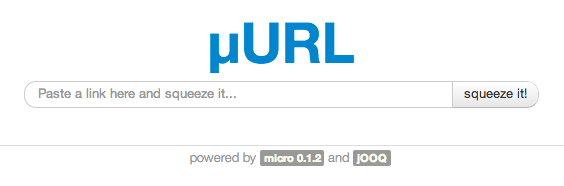

## A simple and fast url shortener web app demo using Micro and jOOQ

This is a very basic web application using the Micro MVC framework and the very cool [jOOQ](http://http://www.jooq.org/) library, "jOOQ generates Java code from your database and lets you build typesafe SQL queries through its fluent API." This small project is a flexible quick-start web application that you can customize further to suit your requirements. Some of the features demonstrated in this web application:

  - [jOOQ](http://http://www.jooq.org/) for elegant database access and data manipulation. To learn more about jOOQ, please follow this link: [jOOQ: Manuals, Documentation, Tutorials](http://www.jooq.org/learn)
  - µ[Micro](http://micro.simplegames.ca) as a generic Java framework for quick web application development
  - [Chart.js](http://chartjs.org) HTML5 Charts using the canvas element
  - [Bootstrap](http://getbootstrap.com/2.3.2/) Sleek, intuitive, and powerful front-end framework for faster and easier web development.
  - [Velocity](http://micro-docs.simplegames.ca/views/engines.md#Velocity) for rendering the dynamic content. See how to use [FreeMarker](http://micro-docs.simplegames.ca/views/engines.md#Freemarker) if you wish.
  - [i18N](http://micro-docs.simplegames.ca/internationalization.md) localization support enabled
  - reusable web content/fragments; `partials` and `templates`
  - [routing](http://micro-docs.simplegames.ca/routing.md/) and [extensions](http://micro-docs.simplegames.ca/extensions.md/)
  - customizable web templates wrapping around errors 404 and 500
  - and more!

### Playing with the demo

Open a console and clone this repo:

    $ git clone https://github.com/florinpatrascu/jooq_m_url_shortener

Change directory to get inside the `jooq_m_url_shortener` folder:

    $ cd jooq_m_url_shortener

And start the web application:

    $ ./run.sh

You can access this app at: `http://localhost:8080`, `http://0.0.0.0:8080` or `http://localhost` if you are forwarding port 80 to 8080. You should be able to see this home page:

enter a full url and squeeze it :) If the url has a history, you'll also see a simple chart representing the number of hits on the shortened url in the last few months:

For security reasons and to demonstrate the versatility of Micro, the user running this demo has the option to decide the domains the web users can refer to in their shortened links (excerpt from `WEB-INF/config/application.bsh`):

    // restrict the URL shortening service to serve just a handful of domains:
    String[] domainRestrictions = new String[]{
        "^https?://([^/@]*\\.)?simplegames\\.ca(/.*)?$",
        "^https?://([^/@]*\\.)?flop\\.ca(/.*)?$",
        "^https?://([^/@]*\\.)?jooq\\.org(/.*)?$"
    };

### To stop the app

Simply press `CTRL-C`.

### Using jOOQ with a different database provider ([PostgreSQL](http://www.postgresql.org/))
Currently, this demo is using the [H2 Database Engine](http://www.h2database.com/html/main.html) and the meta used by the [jOOQ generator](http://www.jooq.org/doc/3.3/manual/code-generation/) is described by a simple xml file: 

    the contents of: WEB-INF/codegen.xml

    <?xml version="1.0" encoding="UTF-8" standalone="yes"?>

    <configuration>
      <jdbc>
        <driver>org.h2.Driver</driver>
        <url>jdbc:h2:./urls_development</url>
        <user>sa</user>
        <password></password>
      </jdbc>

      <generator>
        <database>
          <name>org.jooq.util.h2.H2Database</name>
          <includes>.*</includes>
          <excludes></excludes>
          <inputSchema>PUBLIC</inputSchema>
        </database>

        <generate>
        </generate>

        <target>
          <packageName>models</packageName>
          <directory>./</directory>
        </target>
      </generator>
    </configuration>
    
next, let's explore the steps required to switch from H2 to PostgreSQL.

**todo**

### Deploying to Heroku

**todo**

### Now It's Your Turn
Customize it and build the next most awesome web applications using Micro and jOOQ!

Good luck,  
µ
